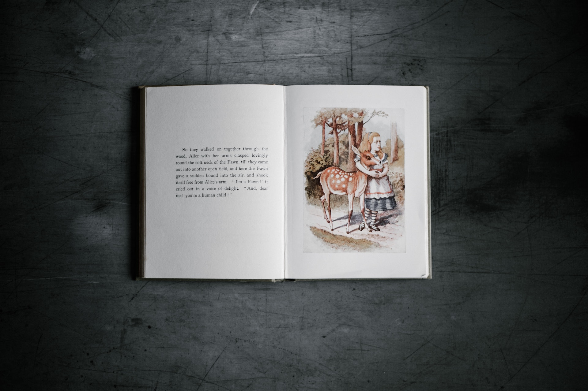

Photo by [Annie Spratt](https://unsplash.com/@anniespratt?utm_source=unsplash&amp;utm_medium=referral&amp;utm_content=creditCopyText) on [Unsplash](https://unsplash.com/s/photos/alice?utm_source=unsplash&amp;utm_medium=referral&amp;utm_content=creditCopyText)

# Lewis Carroll Word Puzzle

I denna övning så ska du skapa ett spel baserat på ett ordpussel skapat av Lewis Carroll.

## Vad

Lewis Carroll är förmodligen mest känd som författaren bakom Alice i underlandet men han var även matematiker och hade en förkärlek för ordlekar, logik och fantasi. Läser du Alice i underlandet speciellt på engelska går det att se att boken är fylld av just detta. Nedan är ett exempel:

> “Take some more tea,” the March Hare said to Alice, very earnestly.

> “I’ve had nothing yet,” Alice replied in an offended tone: “so I ca’n’t take more.” 

> “You mean you ca’n’t take less,” said the Hatter: “It’s very easy to take more than nothing.”

Han tyckte även om att skapa olika typer av pussel både rena logikpussel men pussel som leker med orden.
Ett av hans mesta kända pussel heter *Doublets* som du kommer få göra i denna övning.

### Instruktioner

Pusslet går ut på att du får ett startord och ett slutord och du ska genom att byta ut bokstäver i ditt startord få det till ditt slutord med så få byten som möjligt.

**Regler**
* Du får enbart byta ut en bokstav åt gången.
* Varje ord som bildas måste vara ett korrekt engelskt ord.

**Exempel**

I detta exempel så ska vi få **fyra** att bli **fem**. Observera att själva spelet är på engelska.

* FOUR (startord)
* FOUL (Bytte ut R till L)
* FOOL (Bytte ut U till O)
* FOOT (Bytte ut L till T)
* FORT (Bytte ut O till R)
* FORE (Bytte ut T till E)
* FIRE (Bytte ut O till I)
* FIVE (Slutord)

## Hur

### Steg 1 ###

Börja med att testa pusslet med papper och penna gör ett pussel så du förstår hur det fungerar.
Skriva varje nytt ord under det förgående ordet som jag har gjort ovan och håll dig till reglerna.

Testa med detta pussel:

EYE (startord)

LID (Slutord)

### Steg 2 ###

Efter du har gjort ovanstående pussel och fått en förståelse för hur det fungerar så kan du nu börja fundera på ett lösningsförslag och här kan du ta hjälp av pseudokod. Gör detta med papper och penna igen. Tanken nu är att mer övergripande gå genom hur spelet fungerar och dess regler och börja tänka genom hur du ska lösa det. 

Tanken att göra det med papper och penna är för att det är enklare och inte tänka i för mycket kodtermer utan syftet nu är att få en övergripande ritning som du sedan kan använda dig av.

### Steg 3 ###

Nu kan du börja med att implementera en lösning! Kom ihåg att skriva kod är en iterativ process och man testar ofta olika lösningar/skriver om/förbättrar under tiden.

En användare ska kunna skriva ska få ett startord och slutord (se pussel att använda nedan) och det ska enbart gå att kunna ändra en bokstav i taget. Varje ord ska också kontrolleras mot detta API för att se så det är ett korrekt engelskt ord annars ska det ordet inte godtas.

**API**

https://dictionaryapi.dev/

**Pussel**

Det första ordet i enbart stora bokstäver är startordet och det sista ordet i enbart stora bokstäver är slutordet.

Raise FOUR to FIVE

Cover EYE with LID

Crown TIGER with ROSES

Make WHEAT into BREAD
